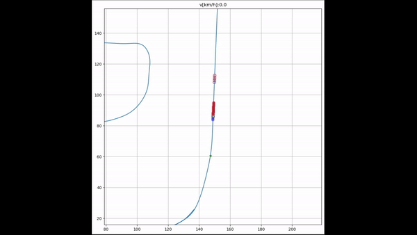
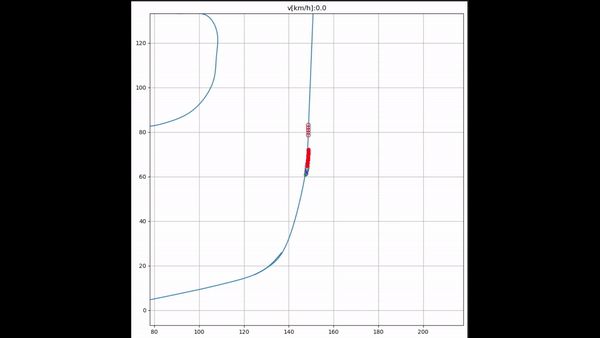
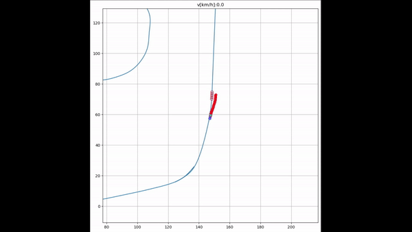

# MCAV-FrenetFrame-Algorithm

## Welcome to the **MCAV Frenet Algorithm Project**!


This repository contains the **MCAV implementation of the Frenet Frame Local Planner** in Python.

<table>
  <tr>
    <td>
      <ul>
        <li>Repository builds on top of the Python robotics implementation of Frenet Framem, by adding additional features such as: <b>Lead Vehicle Following</b>b>, <b>Vehicle Stopping</b>b> and <b>Vehicle Overtaking</b>b>. </li>
        <li><strong>Template Code:</strong> <a href="https://github.com/AtsushiSakai/PythonRobotics">Python Robotics by Atsushi Sakai</a></li>
        <li><strong>Map:</strong> <a href="https://github.com/michigan-traffic-lab/Mcity-AV-Challenge">Mcity AV Challenge</a></li>
        <li><strong>Main Contributor:</strong> MCAV ITS Software Team 2024 
          (<a href="https://github.com/neyuh145">@Huy Nguyen</a>, Tom Playsted, Daniel Cornelius, 
          <a href="https://github.com/treeizard">@Yide Tao</a>) and others</li>
      </ul>
    </td>
    <td>
      
    </td>
  </tr>
</table>

## System Requirements + Environment Preparation
**Code Tested for:** 
- **OS**:Windows 10+, Linux (Ubuntu 22.04)
- **Python Version**: 3.11
- **Package Management Environment**: pip or Conda

**Before Running the code, install required packages by:**
```
pip install -r requirement.txt
```

## Baisc Class Usage
<b> 1. Define Vehicles and Planner </b>
```
vehicle_drive = VehicleController(1.2, 5, 0, 0, np.pi/4)
Planner = FrenetPathPlanner(vehicle_drive)
Planner.set_initial_variables(
        c_speed,
        c_accel,
        c_d,
        c_d_d,
        c_d_dd,
        s0)
```

<b> 2. Define Obstacles </b>
```
obstacle1 = VehicleController(1.2, 5, wx_r[700], wy_r[700], np.pi/2)
obstacle2 = VehicleController(1.2, 5, 50, 10, np.pi/4)
```

<b> 3. Additional Planning Features </b>
```
path = Planner.plan(csp, # Reference Path
     ob, # Obsticle List
     lead_exist=lead_vehicle_exist, # Lead Vehicle Exist
     lead_d=diff_vehicles, # Distance Between Lead Vehicle and the Current Vehicle
     lead_v=lead_v, # Lead Vehicle Velocity
     stop_exist = False, # Stop Sign/ Red Traffic light Exit
     stop_d = 0 ) # How Far Before Stopping
```

## Planner Demo

### 1. Emergency Stopping

<div align="center">
    
</div>

### 2. Overtaking Stationary Obstacle

<div align="center">
    
</div>

### 3. Following and Overtaking Slow Obstacle

<div align="center">
    
</div>

## Project Status
- [x] Frenet Planner Implementation
- [x] Emergency Stopping and Vehicle Following 
- [x] Basic Obsticle Avoidance 
- [ ] Active Obsticle Avoidance
- [ ] Understanding of Lanes
